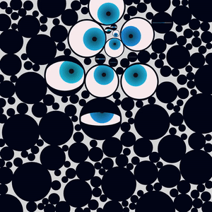
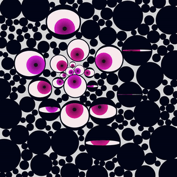
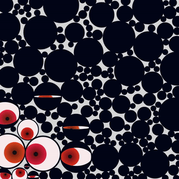
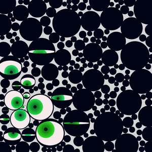

# THEY SEE YOU

## Try it here [lorenzoros.si/THEY-SEE-YOU](https://lorenzoros.si/THEY-SEE-YOU/)

## Background

This week's weekly obsession is googly eyes. I like the way they convert anything (for me, at least) into something stupid and hilarious. I go around with at least a bag of them in my pockets, ready to be stuck to any surface unlucky enough to be in the wrong place (near me) at the wrong time (when I'm near them).

I wanted to stick as many googly eyes as I could inside a canvas and make them follow my mouse around. I got that working but it was missing... something.

I started playing around with colors and I quickly realized this would work way better if they were less goofy and way more creepy.

I wanted to give this whole project a vague aura of creepiness and unease. Imagine this sketch being drawn on a bigger screen! This would really creep me out.

As I always do with my interactive projects, I publish the link and a few pre-rendered (albeit in low-quality) videos on this page, as well as in my [Instagram profile](https://instagram.com/lorossi97). Follow me to view my work and see what I like to do!

## Technical stuff

The whole animation is rendered in a surprisingly smooth manner on a JS canvas. The eyes are placed before everything else is drawn using a circle packing algorithm. It takes way less than I was anticipating, as it takes only a few milliseconds to find space for all the eyes.

## Output

## Credits

This project is distributed under Attribution 4.0 International (CC BY 4.0) license.
